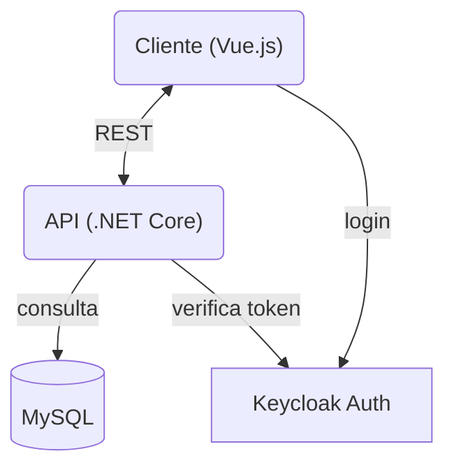

# 🚀 E-commerce Fábrica de Projetos Ágeis


> Um sistema completo de e-commerce desenvolvido como parte da disciplina "Fábrica de Projetos Ágeis 4" da UNIMAR. Este projeto integra um frontend moderno em Vue.js com uma API robusta em .NET, utilizando Keycloak para autenticação segura.

---

## 📋 Índice

- [Sobre o Projeto](#-sobre-o-projeto)
- [Tecnologias Utilizadas](#-tecnologias-utilizadas)
- [Funcionalidades](#-funcionalidades)
- [Arquitetura](#-arquitetura)
- [Pré-requisitos](#-pré-requisitos)
- [Instalação e Execução](#-instalação-e-execução)
  - [Backend (API)](#backend-api)
  - [Frontend](#frontend)
- [Autenticação (Keycloak)](#-autenticação-keycloak)
- [Equipe](#-equipe)

---

## 📖 Sobre o Projeto

Este projeto visa simular um ambiente real de comércio eletrônico, oferecendo funcionalidades essenciais tanto para clientes quanto para administradores. O sistema foi projetado com foco em escalabilidade, segurança e experiência do usuário.

---

## 🛠 Tecnologias Utilizadas

### Frontend
- **Vue.js 3** (Composition API)
- **Vite** (Build tool)
- **Tailwind CSS** (Estilização)
- **Pinia** (Gerenciamento de Estado)
- **Vue Router** (Roteamento)
- **Axios** (Requisições HTTP)
- **FontAwesome** (Ícones)

### Backend
- **C# .NET 8**
- **Entity Framework Core**
- **MySQL** (Banco de Dados)
- **Swagger** (Documentação da API)

### Infraestrutura & Segurança
- **Keycloak** (Identity and Access Management)
- **Docker** (Containerização - *Opcional*)

---

## ✨ Funcionalidades

### 👤 Área do Cliente
- **Catálogo de Produtos:** Visualização de produtos com paginação e busca.
- **Carrinho de Compras:** Adicionar/remover itens, alterar quantidades, cálculo de subtotal.
- **Checkout:** Fluxo de finalização de compra com modal de pagamento (Cartão/PIX).
- **Meus Pedidos:** Histórico de compras com detalhes e status.
- **Cupons de Desconto:** Aplicação de cupons promocionais no carrinho.
- **Cálculo de Frete:** Simulação de frete baseada no CEP.

### 🛡️ Área Administrativa
- **Dashboard:** Visão geral do sistema.
- **Gestão de Produtos:** CRUD completo de produtos (criar, editar, deletar).
- **Gestão de Categorias:** Organização de produtos em categorias.
- **Gestão de Cupons:** Criação e administração de regras de desconto.
- **Visualização de Pedidos:** Acompanhamento de todas as vendas realizadas.

---

## 🏗 Arquitetura

O projeto segue uma arquitetura de **SPA (Single Page Application)** consumindo uma **REST API**.



---

## 📦 Pré-requisitos

Antes de começar, certifique-se de ter instalado em sua máquina:
- [Node.js](https://nodejs.org/) (v18+)
- [.NET SDK](https://dotnet.microsoft.com/) (v8.0)
- [SQL Server](https://www.microsoft.com/sql-server/)
- [Keycloak](https://www.keycloak.org/) (Rodando localmente ou em container)

---

## 🚀 Instalação e Execução

### Backend (API)

1. Navegue até a pasta da API:
   ```bash
   cd API
   ```

2. Configure a string de conexão no `appsettings.json` para apontar para seu SQL Server local.

3. Execute as migrações do banco de dados:
   ```bash
   dotnet ef database update
   ```

4. Inicie a API:
   ```bash
   dotnet run
   ```
   A API estará disponível em `http://localhost:5229` (ou porta configurada).

### Frontend

1. Navegue até a pasta do Frontend:
   ```bash
   cd Front-end
   ```

2. Instale as dependências:
   ```bash
   npm install
   ```

3. Inicie o servidor de desenvolvimento:
   ```bash
   npm run dev
   ```
   O frontend estará acessível em `http://localhost:5173`.

---

## 🔐 Autenticação (Keycloak)

O sistema utiliza o Keycloak para autenticação. Certifique-se de que o Keycloak esteja rodando e configurado com:
- **Realm:** `fabrica-projetos` (ou conforme configurado no `auth.js`)
- **Client ID:** `vue-client`
- **Roles:** `admin`, `user`

As configurações de conexão com o Keycloak estão no arquivo `src/auth/keycloak.js` no frontend e no `appsettings.json` no backend.

---

## 👥 Equipe

Desenvolvedores responsáveis pelo projeto:

| Nome | Função | GitHub |
|------|--------|--------|
| **Luiz Henrique** | Front-End Developer | [@lorocks51987](https://github.com/lorocks51987) |
| **Igor Henrique** | Full-Stack Developer | [@IgorHAlves](https://github.com/IgorHAlves) |
| **César Augusto** | Front-End Developer | [@CesarAg05](https://github.com/CesarAg05) |
| **Rafael** | Back-End Developer | [@Rtwosantoss](https://github.com/Rtwosantoss) |
| **André Luiz** | Back-End Developer | [@oandrecarvalho](https://github.com/oandrecarvalho) |

---

## 📄 Licença

Este projeto está sob a licença MIT. Veja o arquivo [LICENSE](LICENSE) para mais detalhes.

---

<p align="center">
  Feito com 💜 pela equipe da Fábrica de Projetos Ágeis
</p>
